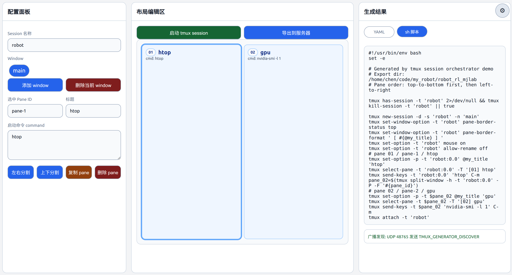

# tmux-generator

[中文](README.zh-CN.md) | English

Web tool for creating, previewing, exporting, launching, and stopping tmux session scripts.



## Features

- Edit session, windows, panes, pane titles, commands, and tags in a browser.
- Preview generated YAML and shell scripts.
- Export YAML, shell scripts, or both to a server-side directory.
- Optionally install quick start, stop, and delete commands.
- Cache UI configuration in `.codex/tmux-generator-ui.json`.
- Launch tmux in a local terminal and stop the generated tmux session from the web UI.
- Access the web UI from another device on the same LAN by using the server machine IP and port.
- Discover the service by UDP broadcast.

## Requirements

- Python 3.9+
- tmux
- One supported local terminal command when launching from a background service: `x-terminal-emulator`, `gnome-terminal`, `konsole`, `xfce4-terminal`, or `xterm`

## Install

Install from wheel:

```bash
pip install tmux_generator-1.0.0-py3-none-any.whl
```

Install from source:

```bash
pip install -e .
```

## Run

```bash
tmux-generator
```

Default server address:

```text
0.0.0.0:6060
```

Open:

```text
http://127.0.0.1:6060
```

LAN access from another device:

```text
http://<server-lan-ip>:6060
```

## Server Config

Optional config path:

```text
~/.tmux-generator/config.json
```

Example:

```json
{
  "host": "0.0.0.0",
  "port": 6060
}
```

## Tests

```bash
PYTHONPATH=src python -m unittest
```
